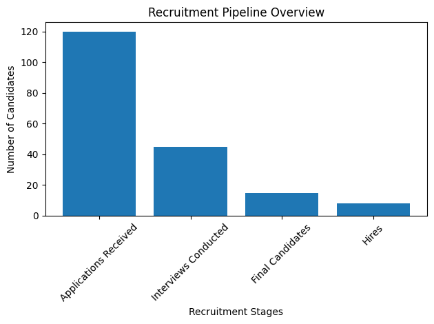
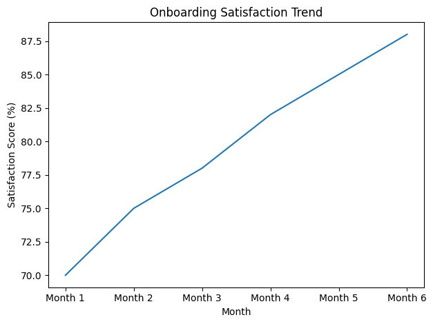

# Portfolio-RH
Portfolio professionnel – Présentation de mes expériences et compétences
# Portfolio – Transition vers les Ressources Humaines

---

## 1. Introduction

Actuellement en Master 2 à ICN Business School, je souhaite orienter mon parcours vers la gestion des Ressources Humaines.

Mon intérêt pour les RH s’est confirmé lors de mon stage au sein du département Ressources Humaines de LAMALIF Holding, où j’ai participé à des missions liées au recrutement et à la gestion administrative du personnel.

Aujourd’hui, je souhaite intégrer un Master spécialisé en Ressources Humaines en alternance afin de construire une carrière dans ce domaine.

---

## 2. Projet Professionnel

Mon ambition est d’évoluer vers des fonctions telles que :

- Chargée de recrutement
- Développement RH
- Contrôle de gestion sociale
- HR Business Partner (à moyen terme)

Je souhaite contribuer à la performance des organisations en mettant l’humain au cœur de la stratégie.

---

## 3. Expérience en Ressources Humaines

### LAMALIF Holding – Stagiaire Ressources Humaines  
Marrakech | Avril 2022 – Juin 2022

**Missions :**
- Analyse des besoins en recrutement
- Suivi des effectifs
- Gestion administrative RH (congés, charges sociales)
- Coordination des besoins matériels des collaborateurs

Cette expérience m’a permis de comprendre les enjeux opérationnels et humains du service RH.

---

## 4. Projets RH Réalisés

### Projet 1 – Mise en place d’un tableau de bord RH

**Objectif :**
Structurer le suivi des recrutements et des effectifs.

**Actions :**
- Identification des indicateurs RH clés (recrutements, délais, effectifs)
- Centralisation des données
- Création d’un tableau de bord Excel
- Mise en place d’un suivi mensuel

**Impact :**
- Meilleure visibilité pour la direction
- Gain de temps administratif
- Amélioration du pilotage RH

---

### Projet 2 – Optimisation du processus d’intégration (Onboarding)

**Objectif :**
Structurer l’accueil des nouveaux collaborateurs.

**Actions :**
- Analyse du processus existant
- Création d’un guide d’intégration
- Élaboration d’une checklist RH / manager
- Proposition d’un planning d’intégration sur 30 jours

**Impact :**
- Amélioration de l’expérience collaborateur
- Réduction des oublis administratifs
- Clarification des rôles RH / managers

---

## 5. Compétences Clés en RH

- Analyse des besoins en recrutement
- Suivi et pilotage des effectifs
- Construction d’indicateurs RH
- Gestion administrative du personnel
- Amélioration des processus RH
- Communication interne

---

## 6. Atouts Différenciants

- Profil analytique structuré
- Rigueur organisationnelle
- Vision stratégique de l’entreprise
- Trilingue : Français, Anglais, Arabe
- Maîtrise avancée d’Excel et outils analytiques

---

## 7. Objectif 2026

Intégrer un Master spécialisé en Ressources Humaines en alternance et évoluer vers des fonctions RH à responsabilité.

---

## Contact

Email : najihidaya5@gmail.com  
LinkedIn : linkedin.com/in/hidayanaji

---

## 📊 Tableaux de Bord RH

### Suivi du Pipeline de Recrutement

Ajout affichage graphiques

---

### Suivi de la Satisfaction Onboarding

